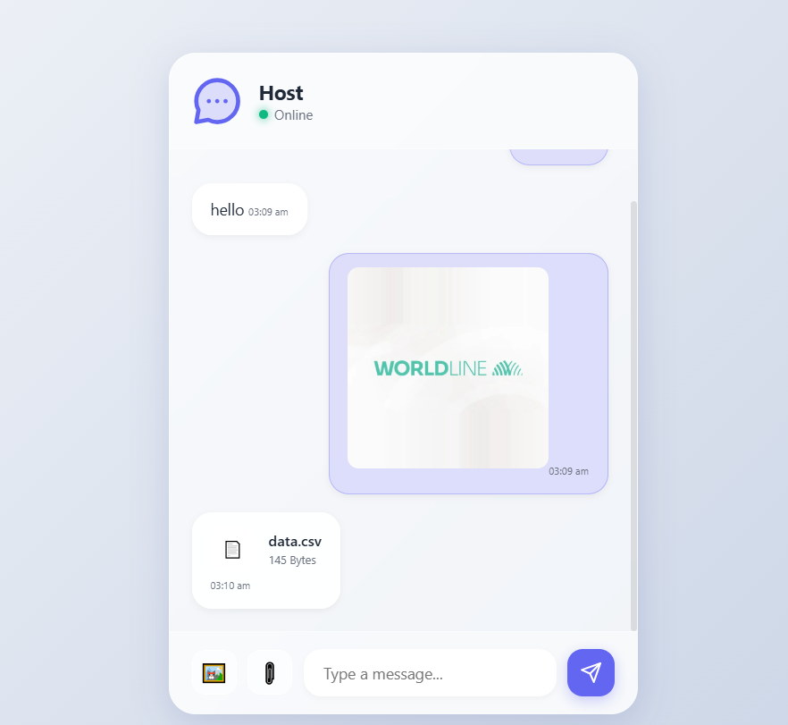
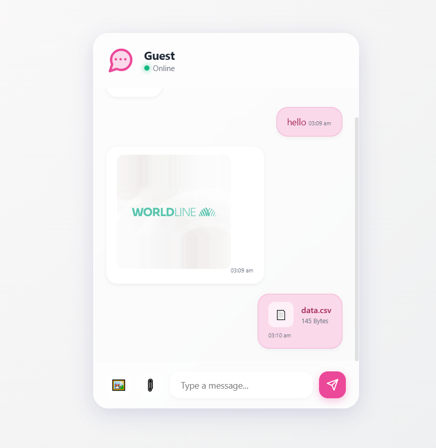

# 🚀 BitChat

**BitChat** is a real-time Python-based chat application built using **Flask** and **Sockets**.
It enables seamless communication between clients through a lightweight and efficient server.

---

## 📌 Features

* 🔥 Real-time messaging
* 🧠 Multi-client support
* 🌐 Flask-based web interface
* ⚡ Socket-based communication
* 📁 Clean project structure
* 🐍 Built with Python 3.10+

---

## 🛠 Tech Stack

* Python
* Flask
* Socket Programming
* HTML (Jinja Templates)
* uv (Python package manager)

---

## 📂 Project Structure

```
BitChat/
│
├── client_app.py        # Client-side socket logic
├── server_app.py        # Server-side socket logic
├── main.py              # Flask application entry point
├── templates/           # HTML templates
├── pyproject.toml       # Project configuration
├── uv.lock              # Dependency lock file
├── .python-version      # Python version file
├── .gitignore
└── README.md
```

---

## ⚙️ Installation & Setup

### 1️⃣ Clone the Repository

```bash
git clone https://github.com/Abhishek-DS-ML-Gupta/BitChat.git
cd BitChat
```

---

### 2️⃣ Create Virtual Environment (Optional but Recommended)

```bash
python -m venv bit
bit\Scripts\activate   # Windows
```

---

### 3️⃣ Install Dependencies

If using uv:

```bash
uv pip install flask
```

Or using pip:

```bash
pip install flask
```

---

## ▶️ Running the Application

### Start the Server

```bash
python server_app.py
```

### Start Flask App

```bash
python main.py
```

### Run Client

```bash
python client_app.py
```

---

## 🌍 How It Works

1. The server starts and listens for client connections.
2. Clients connect using socket communication.
3. Messages are transmitted in real-time.
4. Flask provides a web interface for interaction.

---

## 🧠 Future Improvements

* Add user authentication
* Add database message storage
* Improve UI design
* Add encryption for secure communication
* Deploy on cloud (Render / Railway / AWS)

---

## 📸 Screenshots

<p align="center">
  
</p>

<p align="center">
  
</p>

---

## 🤝 Contributing

Contributions are welcome!

1. Fork the repository
2. Create a feature branch
3. Commit your changes
4. Push to the branch
5. Open a Pull Request

---

## 📜 License

This project is licensed under the MIT License.

---

## 👨‍💻 Author

**Abhishek Gupta**

GitHub: https://github.com/Abhishek-DS-ML-Gupta

---

⭐ If you like this project, don't forget to star the repository!

